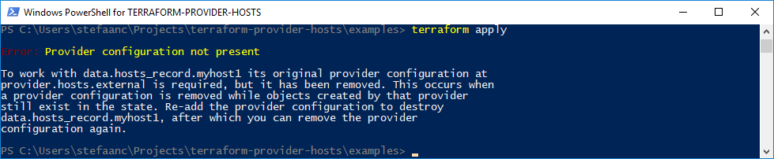

# Terraform Provider Hosts

**a terraform provider to work with hosts-files**


<br/>

## Prerequisites

To build:
- [GNU make](https://www.gnu.org/software/make/)
- [Golang](https://golang.org/) >= v1.13
- [Terraform plugin SDK](https://github.com/hashicorp/terraform-plugin-sdk) ~= v1.0.0

To use:
- [Terraform](https://terraform.io) >= v0.12.9

Optional:
- [PSConsole](https://github.com/stefaanc/psconsole) for PowerShell


<br>

## Building The Provider

1. Clone the git-repository on your machine

   ```shell
   mkdir -p $my_repositories
   cd $my_repositories
   git clone git@github.com:stefaanc/terraform-provider-hosts
   ```
   > `$my_repositories` must point to the directory where you want to clone the repository
   
2. Build the provider

   ```shell
   cd $my_repositories/terraform-provider=hosts
   make release
   ```

   This will build the provider and put it in 
   - `%AppData%\terraform.d\plugins` on Windows
   - `$HOME\.terraform.d\plugins` on Linux
<br/>

 > :bulb:  
 > The makefile provides more commands: `tidy`, `test`, `log`, `report`, `testacc`, `build`, ...
    


<br>

## Installing The Provider

1. Download the provider to your machine

   - go to [the releases tab on github](https://github.com/stefaanc/terraform-provider-hosts/releases)
   - download the file that is appropriate for your machine

2. Move the provider from your `Downloads` folder to

   - `%AppData%\terraform.d\plugins` on Windows
   - `$HOME\.terraform.d\plugins` on Linux
<br/>

> :bulb:  
> Alternatively, you can try our latest release-in-progress under the `releases` folder.  No guarantee though this will be a fully working provider.


<br>

## Using The Provider

> :bulb:  
> You can find the following examples (and more) under the `examples` folder

### provider "hosts"

Defines a provider for a hosts-file.
  
```terraform
provider "hosts" {
    file = "./hosts-test.txt"
    zone = "myzone"
}
```

Arguments | &nbsp;   | Description
:---------|:--------:|:-----------
`file`    | Optional | The path to the `hosts`-file <br/>- defaults to `"C:\Windows\System32\drivers\etc\hosts"` on Windows or `"/etc/hosts2` on Linux<br/><br/> The default file is usually good for production, but a different file can be specified for testing of your terraform configuration.
`zone`    | Optional | The name of the zone in the `hosts`-file <br/>- defaults to `"external"` <br/><br/>A zone is a concept that was introduced to clearly split the records in the hosts-file in one or more sections that are managed by terraform and a section that is not managed by terraform.  See [Using Zones](#using-zones) for more information.<br/><br/> The default `"external"` zone only allows you to use "datasources".  If you want to create and maintain "resources", then a zone-name (different from `"external"`) will need to be specified.

<br>

### Data-sources

#### data "hosts_record"

Reads a record from the hosts-file.  Records in a hosts-file look something like `1.1.1.1   myhost1 myhost1.local   # server myhost1`

```terraform
data "hosts_record" "myhost1" {
    name = "myhost1"
}
```

Arguments | &nbsp;   | Description
:---------|:--------:|:-----------
`name`    | Required | A name of the record that is to be read.<br/><br/>  A records can have multiple names, but only one of the names of the record should be enough to identify the record (provided no other records with the same name has been manually added by mistake).<br/><br/>  In the illegal case where there are multiple records with the same name, the provider will not be able to find a **single** matching record. 
  
Exports     | &nbsp;   | Description
:-----------|:--------:|:-----------
`record_id` | Computed | An internal `record_id` for the record that is read, for instance `1`<br/><br/>Remark that the internal `record_id` does not persist over different terraform action.  It can change as records are added to or deleted from the hosts-file.
`address`   | Computed | The address of the record that is read, for instance `"1.1.1.1"`. 
`names`     | Computed | An array of names for the record that is read, for instance `[ "myhost1", "myhost1.local" ]`. 
`comment`   | Computed | The comment of the record that is read, for instance `" server myhost`"`. 


> :bulb:  
> It may be a good idea to add an `alias` to your provider configuration and a `provider` to your data-source configuration.  This avoids terraform going to the default "production" `hosts`-file when you (per accident) delete your provider configuration and run `terraform refresh` (or `terraform plan` or `terraform apply`).  Not doing this may silently update your terraform state with unwanted information from the "production" `hosts-file` instead of deleting the information. 
> 
> ```terraform
> provider "hosts" {
>     alias = "external"
>
>     file = "./hosts-test.txt"
> }
>
> data "hosts_record" "myhost1" {
>     provider = hosts.external
>
>     name = "myhost1"
> }
> ```
>
> When you now apply this config, then delete both the provider and datasource from the config, and then run `terraform refresh` (or `terraform plan` or `terraform apply`), you will get the following error
> 
> 


<br>

### Resources

#### resource "hosts_record"   

Manages a record in the hosts-file.  Records in a hosts-file look something like `111.111.111.111   myhost111 myhost111.local   # server myhost111`

```terraform
resource "hosts_record" "myhost111" {
    address = "111.111.111.111"
    names   = [ "myhost111", "myhost111.local" ]
    comment = "server myhost111"
    notes   = "a first test-server"
}
```

Arguments  | &nbsp;   | Description
-----------|:--------:|------------
`address`  | Required | The IP address of the record that is to be created.<br/><br/> When changing the address of a record, the old record will be deleted and a new record will be created.
`names`    | Required | An array of names for the record that is to be created<br/><br/> Remark that names are always converted to lower-case when written to the hosts-file and when written to the terraform state.<br/><br/> When changing one of the names of a record, or when adding or dropping a name to the record, the old record will be deleted and a new record will be created.
`comment`  | Optional | The comment for the record that is to be created<br>- defaults to ""
`notes`    | Optional | Notes about the record that is to be created<br>- defaults to ""<br/><br/> Remark that notes are not saved in the hosts-file.  This means that when you add notes, this will lead to a harmless terraform update action in order to save them in the terraform state, and do this every time you apply your configuration.
  
Exports     | &nbsp;   | Description
:-----------|:--------:|:-----------
`record_id` | Computed | An internal `record_id` for the record that is read, for instance `1`<br/><br/>Remark that the internal `record_id` does not persist over different terraform action.  It can change as records are added to or deleted from the hosts-file.

> :bulb:  
> Remark that it is perfectly legal to have multiple records with the same `address`, but it is illegal to have multiple records with the same `name`.  The terraform `"hosts_record"`-resource doesn't allow to create records with such conflicting names.  However, externally managed records may have them by mistake.  

**_Importing a hosts-record_**

You can import a record using any of the hosts-file's names as an import-ID.

- Assuming you have an existing hosts-file.

  ```text
  ##### Start Of Terraform Zone: myzone ##########################################
  999.999.999.999 myhost999.local
  ##### End Of Terraform Zone: myzone ############################################
  ```

  > :bulb:  
  > Remark that this will only work when the record is in a hosts-zone, because "external " records cannot be managed by terraform.

- Assuming you have a `host_record` resource configuration, and this resource is not yet/anymore in the terraform state

  ```terraform
  provider "hosts" {
      alias = "myzone"
 
      file = "./hosts-test.txt"
      zone = "myzone"
  }

  resource "hosts_record" "myhost999" {
      provider = hosts.myzone

      address = "999.999.999.999"
      names   = [ "myhost999", "myhost999.local" ]
      comment = "server myhost999"
      notes   = "my lost server"
  }
  ```

  When terraform tries to create it then this will fail since it already exists.  You can edit the hosts-file and delete the resource, and then re-create it using terraform.  However, this may be a bit more involved when you need to automate this.  Alternatively you can import it.

- Run the terraform command using any of the names in the hosts-file.  The name doesn't have to be one of the names in the resource configuration.

  ```shell
  terraform import -provider="hosts.myzone" "host_record.myhost999" "myhost999.local"
  ```

  The resource will be imported from the hosts-file into the terraform state, and the usual lifecycle will be applied next time `terraform apply` is run.

  > :bulb:  
  > Remark that without specifying a provider option, `terraform import` will use the default hosts provider (the provider without alias).  If there is no default provider specified in your configuration (all your providers have an alias), a provider with default values will be used (the default path to the "production" hosts-file and the default "external" zone).
  > Remark also that the provider used in the import command, does not have to be the same as the provider in the configuration of the resource.  However, this will lead to errors when applying the configuration, since both providers are pointing to a hosts-file on the same server.


<br>

## Using Zones

Zones in a hosts-file are used to clearly split managed from unmanaged records.  It is bad practise to edit the managed zones manually, although it is the only way to clean them up when you loose the terraform state file.  Re-applying terraform will re-create the zones and the records that are still in use.

```text
1.1.1.1   myhost1 myhost1.local   # externally managed
2.2.2.2   myhost2 myhost2.local   # externally managed
3.3.3.3   myhost3 myhost3.local   # externally managed

##### Start Of Terraform Zone: myzone1 #########################################
111.111.111.111 myhost111 myhost111.local
222.222.222.222 myhost222 myhost222.local
333.333.333.333 myhost333 myhost333.local
##### End Of Terraform Zone: myzone1 ###########################################
##### Start Of Terraform Zone: myzone2 #########################################
444.444.444.444 myhost444 myhost444.local
555.555.555.555 myhost555 myhost555.local
666.666.666.666 myhost666 myhost666.local
##### End Of Terraform Zone: myzone2 ###########################################
``` 

> :information_source:  
> At this moment, zones are not automatically deleted when all its records are deleted.  You will need to manually delete such zones if you want to get rid of them.


<br>

## More Information

[**Resource lifecycle methods**](./docs/resource-lifecycle-methods.md)
[**API data structure**](./docs/api-data-structure.md)  


<br>

## For Further Investigation

- delete a zone from the hosts-file when all records in the zone are deleted - this will be solved if/when we introduce `hosts_zone` resources
- delete a hosts-file when all zones & records are deleted and no external records exist - this will be solved if/when we introduce `hosts_file` resources
- working with hosts-files on remote servers
- provide a post create/delete action (the provisioners only work post-create), f.i. to restart a service that needs to be restarted after every change to the hosts-file
- add acceptance tests
- terraform-style documentation
- test for memory leaks